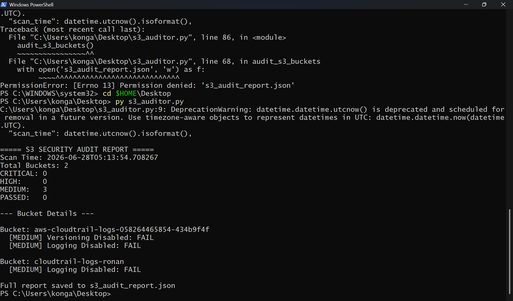
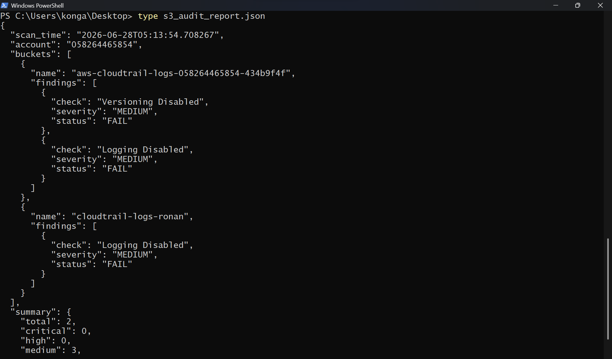
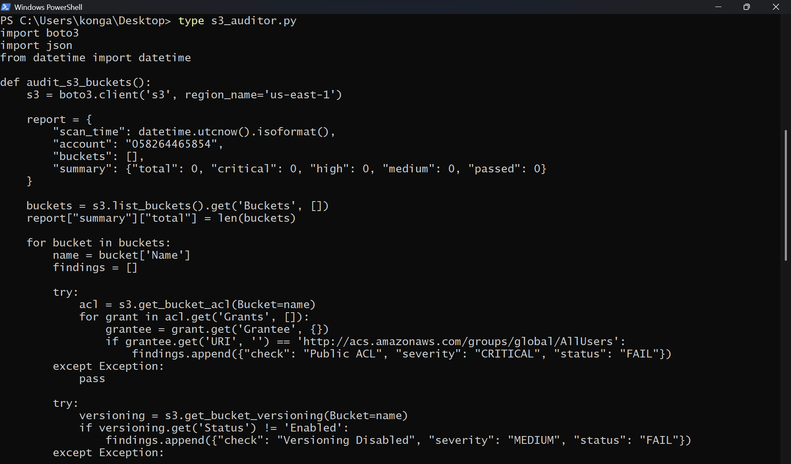

# S3 Security Auditor

A Python security tool that audits AWS S3 buckets for misconfigurations using boto3. Scans all buckets in an AWS account and generates a structured JSON risk report with severity-classified findings.

---

## What It Checks

| Check | Severity | Description |
|---|---|---|
| Public ACL | CRITICAL | Bucket or objects accessible to anyone on the internet |
| Public Access Block Missing | CRITICAL | No public access block configuration set |
| Encryption Disabled | HIGH | Server-side encryption not enabled |
| Public Access Block Incomplete | HIGH | Some public access block settings are missing |
| Versioning Disabled | MEDIUM | Object versioning not enabled |
| Logging Disabled | MEDIUM | Server access logging not configured |

---

## Screenshots

### 1. Audit Output


### 2. JSON Report


### 3. Script Code


---

## Sample Output

```
===== S3 SECURITY AUDIT REPORT =====
Scan Time: 2026-06-28T05:13:54.708267
Total Buckets: 2
CRITICAL: 0
HIGH:     0
MEDIUM:   3
PASSED:   0

--- Bucket Details ---

Bucket: aws-cloudtrail-logs-058264465854-434b9f4f
  [MEDIUM] Versioning Disabled: FAIL
  [MEDIUM] Logging Disabled: FAIL

Bucket: cloudtrail-logs-ronan
  [MEDIUM] Logging Disabled: FAIL

Full report saved to s3_audit_report.json
```

---

## Sample JSON Report

```json
{
  "scan_time": "2026-06-28T05:13:54.708267",
  "account": "058264465854",
  "buckets": [
    {
      "name": "aws-cloudtrail-logs-058264465854-434b9f4f",
      "findings": [
        {"check": "Versioning Disabled", "severity": "MEDIUM", "status": "FAIL"},
        {"check": "Logging Disabled", "severity": "MEDIUM", "status": "FAIL"}
      ]
    }
  ],
  "summary": {
    "total": 2,
    "critical": 0,
    "high": 0,
    "medium": 3,
    "passed": 0
  }
}
```

---

## Setup

### Prerequisites
- Python 3.x
- AWS account with S3 buckets
- IAM user with `AmazonS3ReadOnlyAccess` policy

### Install dependencies

```bash
pip install boto3
```

### Configure AWS credentials

```bash
aws configure
```

Enter your AWS Access Key ID, Secret Access Key, region (`us-east-1`), and output format (`json`).

### Run the auditor

```bash
python s3_auditor.py
```

The script will:
1. List all S3 buckets in your account
2. Run 5 security checks per bucket
3. Print a summary to the terminal
4. Save the full report to `s3_audit_report.json`

---

## Results

- Scanned 2 S3 buckets across 1 AWS account
- Identified 3 MEDIUM severity misconfigurations
- 0 CRITICAL or HIGH findings
- Generated structured JSON report for remediation tracking

---

## Skills Demonstrated

- Python security automation with boto3
- AWS S3 security configuration assessment
- IAM least-privilege access key management
- Structured JSON report generation
- Risk classification by severity (CRITICAL/HIGH/MEDIUM)
- Cloud security posture evaluation
